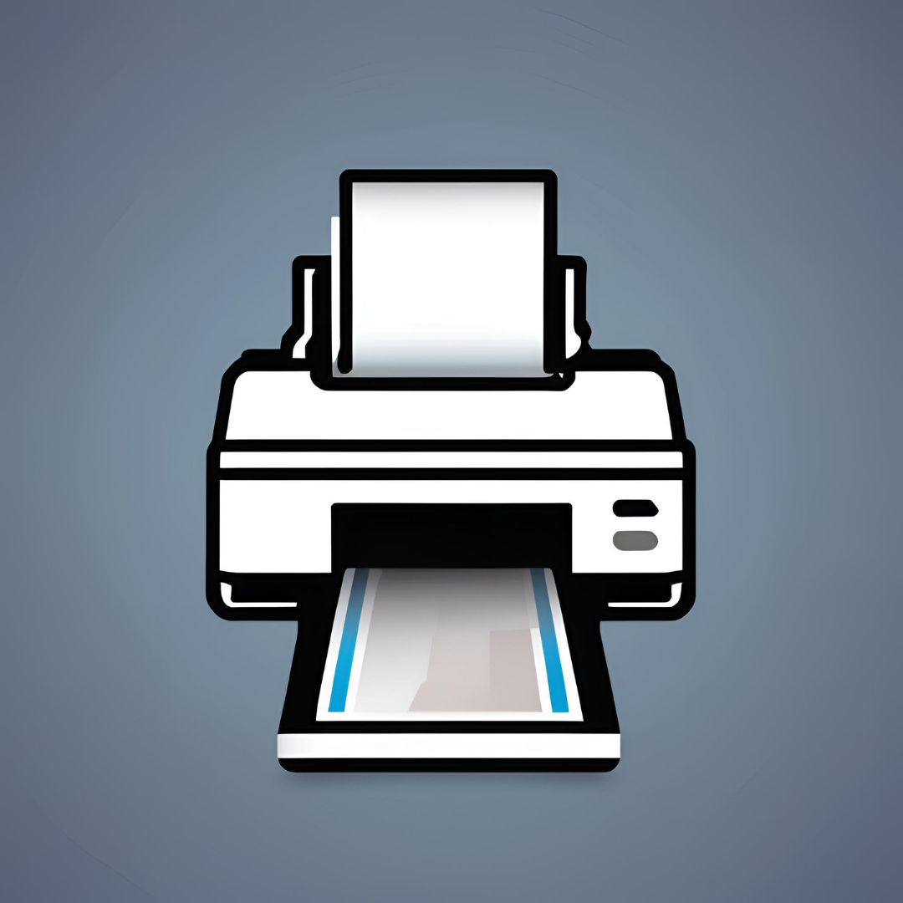

# Pretty Print VS Code Extension

This is a Visual Studio Code extension that helps users process code and Markdown files in a selected file or folder by converting them into a printable format. The extension:

1. **Converts code files to Markdown**: Any supported code file (See Supported Languages) in the selected folder is converted to a Markdown file with syntax highlighting and line numbers.
2. **Converts Markdown files to HTML**: Markdown files are then converted to HTML, combining them into one file.
3. **Prepares a Printable HTML**: It generates an HTML file that can be printed directly, with styled code blocks, line numbers, and integrated with the Katex library for rendering LaTeX.

## Features

[Change log](CHANGELOG.md)

- **Supports multiple programming languages**: See Supported Languages for more information
- **Line Numbers in Code**: Toggle `prettyprintcode.showLineNumbers` to add or remove the manual code block numbering in the printout.
- **LaTeX Support**: Uses Katex to render LaTeX expressions in Markdown.
- **Print-Friendly HTML**: Converts Markdown to HTML with an automatic print trigger, allowing users to print the document directly from their browser.
- **Obsidian-style embeds**: Image references like `![[diagram.png]]` automatically resolve from the `./attachment` folder beside the Markdown file, mirroring Obsidian vault behavior.
- **Ignore files that you don't want to print**: (`Ctrl+Shift+P`) and type `Preferences: Open User Settings`. Search for `prettyprintcode.ignore` and add your patterns to ignore.
- **Custom header & footer templates**: Adjust `prettyprintcode.documentHeader` / `prettyprintcode.documentFooter` to override the per-file header and footer. Placeholders such as `{{displayPath}}`, `{{relativePath}}`, `{{fileName}}`, and their `raw` variants are supported. Pair with `prettyprintcode.headerFooterStyles` to add bespoke CSS.
- **Selectable code themes**: Pick from built-in Prism themes via `prettyprintcode.codeThemePreset`, or point to your own CSS with `prettyprintcode.codeThemeCustomUrl` (the legacy `codeTheme` setting still works for backward compatibility).

## Installation

Install the extension from Visual Studio Marketplace: [Pretty Print - Visual Studio Marketplace](https://marketplace.visualstudio.com/items?itemName=ViktorLinden.prettyprintcode)

## Usage

1. **Activate the Extension**: Right click on a file or folder in the explorer and choose `Pretty Print`.  
***Alternatively***: Open the Command Palette (`Ctrl+Shift+P`) and type `Pretty Print`. Choose the `Pretty Print` command to activate it. **Select File or Folder**: You'll be prompted to select what you want to print. The extension will process the selected file, or every code and Markdown file inside the chosen folder (including sub directories).

2. **Markdown Conversion**: The extension converts code files to Markdown and places the generated files in a `print` folder next to your selection. When a folder is chosen, that folder gets the `print` directory. When a single file is chosen, the `print` directory is created alongside that file.

3. **Generate HTML**: After converting the files to Markdown, the extension combines them into a single HTML file, which is saved in the same `print` folder.

4. **Open & Print**: The HTML file will automatically open in your default web browser, where you can print the document.

> [!TIP]
> To edit settings please go to vscode user settings and search for `prettyprintcode`

## Key Functions

- **convertCodeToMarkdown**: Converts code files to Markdown with syntax highlighting and formatted code blocks.
- **getAllCodeFiles**: Recursively retrieves all code files (with extensions like `.js`, `.ts`, `.cpp`, etc.) in a selected directory.
- **getAllMarkdownFiles**: Recursively retrieves all Markdown files (`.md`) in the selected directory.
- **addManualLineNumbersToCodeBlocks**: Adds line numbers to code blocks in the HTML output to improve readability.
- **Pretty Print HTML Output**: Combines converted Markdown content into an HTML file ready for printing.

## Supported Languages

The extension now support all languages that PrismJS supports. See Ref for details:

> [PrismJS Supported Languages](https://prismjs.com/#supported-languages)

## Dependencies

This extension uses the following libraries:

- **`markdown-it`**: A markdown parser that renders Markdown content into HTML.
- **`markdown-it-katex`**: A plugin for rendering LaTeX expressions in Markdown.
- **`markdown-it-prism`**: A plugin for syntax highlighting in Markdown using Prism.
- **`cheerio`**: A library for manipulating HTML.
- **`open`**: Opens the generated HTML file in the default web browser.
- **`minimatch`**: A library for matching file paths against glob patterns.

## Contribution

Contributions are welcome! Feel free to submit issues, pull requests, or suggestions to improve the extension.
